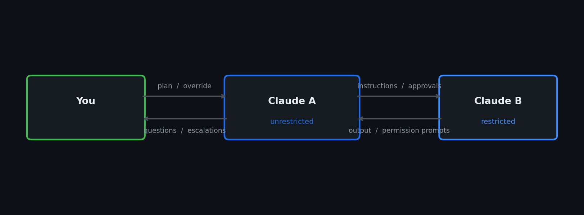

# Homunculus

You have two Claude accounts. Your **unrestricted** Claude (A) can act freely — no permission prompts — but comes at a high token cost, so you don't want it doing all the heavy lifting. Your **restricted** Claude (B) is cheap and can grind through large tasks, but must ask for permission before every action — which normally means you sit there pressing keys all day.

Homunculus solves this: A steers B. A reads everything B outputs, understands what B is doing, and handles every permission prompt with judgment — using almost no tokens to do so. B does the heavy lifting cheaply. You stay in conversation with A. Nothing dangerous slips through without A — and through A, you — explicitly approving it.



A reads B's live transcript to understand what B is doing. The control channel (`capture-pane` / `send-keys`) lets A detect when B is blocked on a permission prompt and press the right key. B never knows it is being supervised.

## Use cases

- **Supervised work with a restricted account.** Your restricted Claude (B) must ask for approval before every action. Homunculus lets it work autonomously while your unrestricted Claude (A) acts as the human it needs — approving safe actions, blocking dangerous ones, escalating anything unclear to you.
- **Approval with judgment, not blind clicking.** A reads B's full JSONL transcript to understand *what* B is building and *why* it wants to run each command before deciding. It's not pattern-matching — it's a model making a reasoned call.
- **Multiple workers.** A can supervise several B sessions in parallel or sequence — independent tasks running concurrently, phased work running one after another.
- **Full audit trail.** Every decision A makes is logged with a reason. Every screen B showed at the moment A acted is captured.

## Example

You're in a Claude A session planning a feature. Once you've aligned, you say:

> "Use the homunculus skill to implement this."

A spins up a B session under your restricted account in the project directory, sends it the implementation brief, and starts watching. When B wants to run a shell command, A reads what it is, checks it against the plan, and presses `1` to approve or `3` to deny. If B tries a force push, writes outside the project, or runs a `curl | sh`, A blocks it and tells B to take a different approach. You only get pulled in when A genuinely doesn't know what to do.

## Installation

Requires: `tmux` (≥ 3.0), `claude` CLI, `python3`.

### 1. Install the Homunculus plugin

```bash
claude plugin marketplace add github:ssenge/Homunculus
claude plugin install homunculus@homunculus
```

This makes `/homunculus` available in any Claude Code session.

### 2. Set up session A (your unrestricted account)

This is the Claude session you already use. No changes needed. A must be a full interactive login so it has access to all tools.

```bash
claude auth status   # confirm you are logged in with your unrestricted account
```

### 3. Set up session B (your restricted account)

Get a long-lived inference token for your restricted account:

```bash
claude setup-token
```

This prints a token. Store it:

```bash
umask 077
echo 'export CLAUDE_CODE_OAUTH_TOKEN=sk-ant-oat…' > ~/.claude-restricted.env
```

Homunculus sources this file when launching B. The token lets B work and be driven via tmux — which is all it needs.

### 4. Use it

In your unrestricted Claude A session, invoke the skill:

```
/homunculus
```

This loads Homunculus into A. A will ask you what to build and in which directory. It then:

1. Launches a B session in a tmux pane using your restricted account's token
2. Sends B your instruction
3. Monitors B's output continuously via its live JSONL transcript
4. Whenever B raises a permission prompt, A reads what action B wants to take, decides based on your plan, and presses the appropriate key — `1` to approve, `3` to deny
5. If A is unsure, it surfaces the question to you instead of guessing
6. When B finishes, A reports what was done and closes the session

You stay in conversation with A throughout. You can redirect, add context, or override any decision at any point.

---

**Autonomous mode** (no A in the loop, rules-only):

```bash
bash homunculus.sh --claude "implement the auth module" --cwd /path/to/project
```
